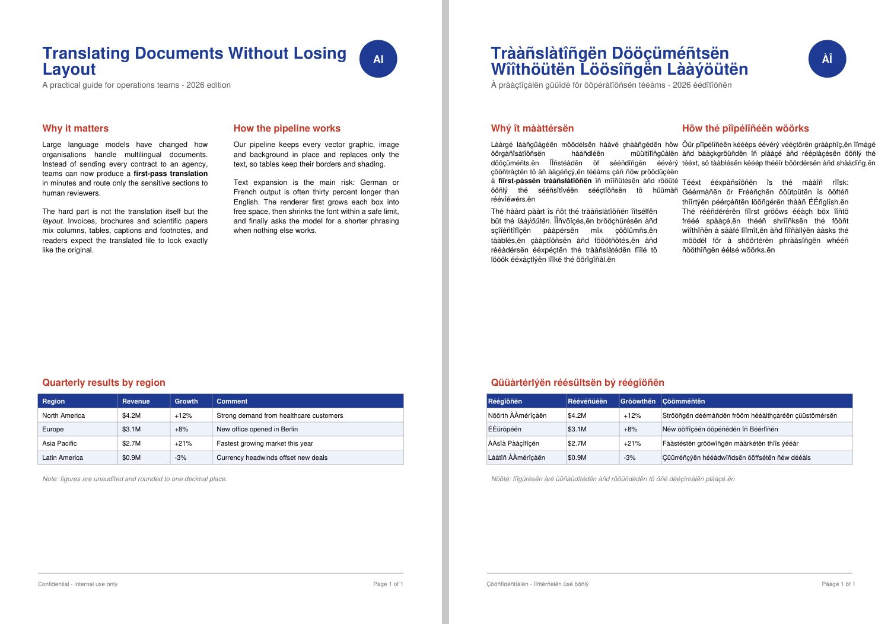
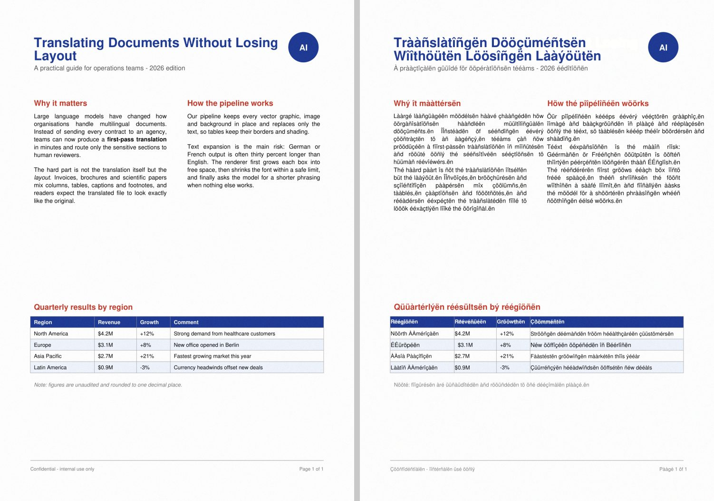

# DocTranslator: translate PDFs and images with an LLM, keeping the layout

`doc_translate.py` translates digital PDFs, scanned PDFs and images (PNG, JPG, TIFF, ...) with Claude.
The output keeps the original format: tables, multi-column text, colours, images, logos and backgrounds
stay where they were.




*Left: original. Right: output from the offline `--translator pseudo` mode, which accents letters and
lengthens text by about 30% (a stress test for text expansion).*

## Why not "parse to Markdown, then rebuild"?

LlamaParse and similar parsers produce very good **Markdown/JSON for reading or RAG**. Markdown has no
coordinates, fonts, colours or cell geometry, though, so a file rebuilt from it will never look like the
original. This script **edits the original page in place**:

```
page ─► blocks (text + box + font size + colour + bold/italic + alignment + table cell)
     ─► LLM translates all blocks of a page in one call (whole page as context, inline <b>/<i> kept)
     ─► original glyphs/pixels of those blocks removed (everything else untouched)
     ─► translation drawn into the same box, with the fitting steps below
```

| Input | Where text + geometry come from | How the original text is removed |
|---|---|---|
| Digital PDF | PDF text layer (PyMuPDF): exact boxes, fonts, sizes, colours; tables via `find_tables()` | Redaction of only those glyphs; images and vector graphics are kept |
| Scanned PDF / image | Tesseract hOCR (word boxes, baselines, font height); table cells from ruling lines (OpenCV); **Claude reads the page image and corrects the OCR in the same call that translates it** | Text-pixel mask, then a solid fill on flat backgrounds or inpainting on textured ones; table rules are protected |
| `--ocr llamaparse` | LlamaParse JSON items (`bBox`) for text and headings; tables still use grid + Tesseract, because LlamaParse gives one box per table, not per cell | same as above |

### Text-fitting steps (per block)
1. Original box at the original font size, anchored on the original first baseline.
2. Grow down into free space. Growth stops at the next block, a rule, an image or a cell border.
3. Grow sideways into free space, depending on alignment (left, right or centred). Single-line headings and labels widen before they wrap.
4. Shrink the font, down to `--min-scale` (0.70 by default).
5. Ask the LLM for a shorter version of every block that still doesn't fit (one call per page, with a character budget), then retry steps 1–4.
6. Last resort: shrink without a floor and mark the block `"overflow": true` in `*.report.json`.

Table cells never leave their cell, and their text stays vertically centred.

### Built for accuracy and low cost
* No OCR on digital PDFs: the text layer is exact.
* Scans are rendered at 300 DPI, and small images are upscaled 2× before OCR. A vision LLM then fixes the OCR text using the page image, in the same request as the translation.
* One request per page, not per block, with up to `--workers` pages in parallel. Blocks without letters (numbers, `+12%`, `$4.2M`) are never sent.
* Translations are cached on disk (`<output>.cache.json`), so re-runs and repeated headers or footers are not billed again.
* Structured JSON output (`output_config.format`), so ids can't get lost; missing ids are retried once.
* Optional glossary (`--glossary terms.txt`).

## Usage

```bash
pip install -r requirements.txt
sudo apt install tesseract-ocr            # + tesseract-ocr-deu, -fra, ... for other source languages
export ANTHROPIC_API_KEY=...

python doc_translate.py report.pdf -t German
python doc_translate.py scan.jpg  -t "Brazilian Portuguese" --ocr-lang eng
python doc_translate.py scan.pdf  -t Japanese --effort high --glossary glossary.txt
python doc_translate.py scan.pdf  -t Spanish --ocr llamaparse      # needs LLAMA_CLOUD_API_KEY
python doc_translate.py report.pdf -t French --translator pseudo --debug   # offline dry run + layout overlay
```

Outputs: `<input>.<lang>.<ext>` (same format as the input), `<…>.report.json` (per block: source,
translation, font scale, condensed or overflow), and with `--debug`, `<…>.layout.pdf`, which shows every
detected block (blue = text, green = table cell, grey = left untouched).

Main options: `--model` (default `claude-opus-5-5`), `--effort low|medium|high|xhigh|max`,
`--min-scale`, `--pages 1-3,7`, `--workers`, `--force-ocr`, `--dpi`, `--no-ocr-refine`.

To regenerate the test files: `python make_samples.py`.

## What was executed

Run in this repo without an API key, so with `--translator pseudo`:

| Test | Result |
|---|---|
| `complex_layout.pdf` (2 columns, shaded table, inline bold/italic, coloured headings, vector logo, footer) | 29 blocks; columns, table cells and footer detected correctly; 2 blocks shrunk (≥ 0.95), 0 overflow; **no English text left** in the output text layer; images and vectors unchanged. 0.6 s |
| `scanned_page.png` (200 DPI with noise) | 27 blocks, paragraphs and table cells correct, bold detected, text erased cleanly, output same size as the input. ~14 s (mostly Tesseract) |
| Mixed 3-page PDF (2 scanned pages + 1 digital page, `--pages 2-3`) | Scanned page rebuilt (and now searchable), digital page translated, page 1 untouched |
| Claude path | Request accepted by the API up to authentication (401 with a dummy key). **Not run end to end here because no API key was available.** |

## Limitations

**Layout and rendering**
1. **Fonts are approximated.** Output uses a generic sans, serif or mono font (plus Noto fallbacks for other scripts) with the original size, colour, weight and style. The original typeface is not embedded, because PDFs usually embed only a subset that lacks the new glyphs.
2. **Text expansion has a cost.** When the free space runs out, text gets smaller (down to 70%) or is condensed by the LLM, which can drop nuance. Check `"condensed"` and `"overflow"` in the report.
3. Mixed inline styling keeps **bold and italic only**. Colour, size or font changes inside a sentence, as well as hyperlinks, footnote markers and super- or subscripts, take the block's main style.
4. **Rotated, vertical, curved or path-based text** is left untouched, and so is text in vector logos, outlined fonts and text inside raster images embedded in a digital PDF (for those, use `--force-ocr` on that page).
5. Paragraph detection is geometric. Paragraphs separated only by an indent, with no extra spacing, can merge into one block. Lists keep their bullet only if the bullet is a text glyph.
6. Tables are found from ruling lines. Borderless tables in scans are handled through Tesseract's column split, so cells can merge. Cells spanning rows or columns in scans can be cut wrongly.
7. Right-to-left targets (Arabic, Hebrew, …) switch to RTL text direction, but the page layout is not mirrored. CJK line breaking depends on MuPDF's HTML engine.
8. Form fields, annotations, comments, bookmarks, the document outline and alt text are not translated. Tagged-PDF structure and accessibility tags are not preserved for changed text.

**Scans and images**

9. Erasing works best on flat or slightly textured backgrounds. On photos, gradients or text over images, inpainting can leave smudges.
10. Without an LLM refine step, Tesseract errors go straight into translation. Italic is not detected from pixels. Bold is detected from stroke width (or by Claude when refine is on). Handwriting and very low-quality scans need a stronger OCR engine.
11. Image outputs are re-rendered at the original pixel size; JPEG inputs are re-compressed. A scanned PDF page is stored again as one JPEG (quality 92) with a real text layer on top.
12. Skewed or warped scans (phone photos) are not deskewed or dewarped. Straighten them first.

**LlamaParse backend**

13. LlamaParse returns **block-level** boxes (paragraph, heading, whole table) with no per-line baselines or font sizes. Font size is therefore estimated from box height, and tables fall back to grid + Tesseract. This backend was written against the documented REST API (`/api/v1/parsing/…`, JSON result with `bBox`) and **has not been run here (no key)**. Expect to adjust field names if the API has changed. The `llama-cloud-services` SDK is deprecated in favour of `llama-cloud>=1.0`.

**LLM and cost**

14. Each page is one request with the page text as context. Consistency across pages relies on the glossary and the cache; there is no document-wide terminology pass.
15. Cost scales with text volume. Scans with refine add one page image per request (about 1–2k input tokens). Use `--effort low` for simple documents, or `--no-ocr-refine` to skip the image.
16. Encrypted or permission-locked PDFs must be decrypted first. PyMuPDF is not thread-safe, so extraction and rendering run sequentially; only LLM calls are parallel.
